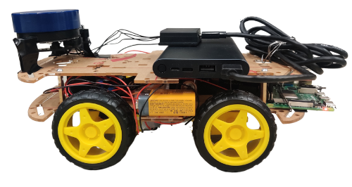

## **Project Title**: **Swarm SLAM for Environment Mapping**

**Team**: Abdalla Mahgoub Eltayeb, Haonen Chen, Anusri Sreenath , Apratim Banerjee

EECS 149/249A Project, Fall 2023

## Abstract
SLAM, or Simultaneous Localization and Mapping, is employed in robotics and autonomous systems for real-time navigation and mapping of unknown environments. In our project, a robot utilizes various sensors, such as LiDAR and stereo vision cameras, to gather data about its surroundings while simultaneously estimating its own position within that environment. The algorithm dynamically integrates sensor measurements and motion control inputs to iteratively refine the robot's estimated pose and construct a detailed map of the environment. SLAM plays a pivotal role in autonomous systems, enabling them to navigate, explore, and interact with their surroundings without a priori knowledge.

## Hardware
- Our robot is equipped with a suite of advanced sensors tailored for comprehensive environmental perception. 
  - **YDLIDAR X2L 360:** LIDAR sensor was used to capture detailed distance measurements, facilitating the construction of an accurate environmental map and enabling robust obstacle detection.
  - **Camera:** To aid navigating the robot with live visual data.
  - **Motor Controllers:** L298N Dual Bridge Motor driver was used for driving the motors of the Robot.
  - **TT motor:** A type of direct current (DC) motor with a dual-shaft design was used for the movement of the Robot.
  - **Raspberry Pi 4:** Main controller, used to process data from the mentioned sensors, and leverage its ROS 1 compatibility and image processing capabilities.

## Hector SLAM
- LiDAR Sensor Scans the Environment: The initial step involves the LiDAR sensor, which performs a comprehensive scan of the environment. The sensor emits laser beams to measure the distance to obstacles, creating a point cloud that accurately represents the surrounding area.
- Occupancy Grid Map Generation: The point cloud data acquired from the LiDAR sensor is processed to generate a 2D grid map. Each cell in this grid represents a specific area in the environment and is classified as occupied, free, or unknown. This map is a probabilistic representation that takes into account the uncertainty inherent in real-world measurements.
- Transform and Compare: The final step in the Hector SLAM algorithm is to transform and compare the newly scanned data with the existing map. This involves aligning and adjusting the current scan to the pre-existing map to find the best fit. This process, known as scan matching, is crucial for updating the map with new information and for the robot to ascertain its current location within the environment.

## System design

- Hardware Layer: The Raspberry Pi 4 is chosen as the development board for its well-known efficiency and adaptability in various applications. The key attributes of the Raspberry Pi 4 include its compact size, processing power, and connectivity options, making it an ideal candidate for embedded system projects.
- Operating System: The Linux operating system is installed on the Raspberry Pi 4 due to its multiple advantages in embedded system environments:
- Middleware: To support our SLAM algorithm, the Robotic Operating System (ROS) middleware is installed on top of the Linux operating system. ROS is selected for its numerous benefits such as compatibility and code reusability, and integrable tools. 
- An intuitive method for controlling our robotic vehicle is through keyboard inputs, using the common 'W', 'A', 'S', 'D' keys for directional movement. 
The control system captures keyboard interrupts — specific signals triggered when the keys are pressed. Each key corresponds to a direction:
W: Forward
A: Left
S: Backward
D: Right

## Map produced by the robot using SLAM
  

